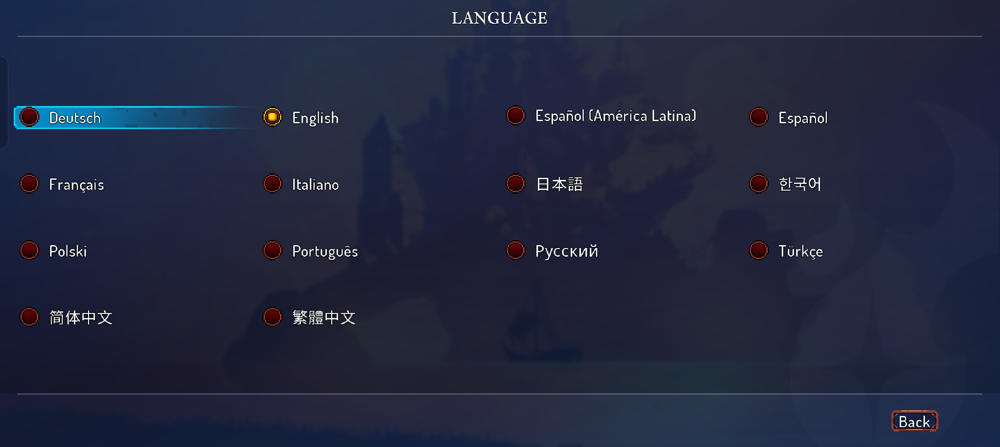
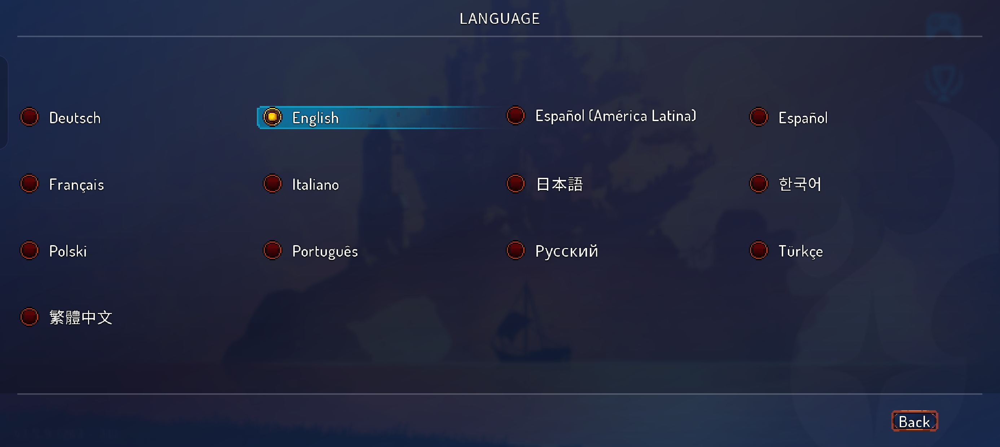
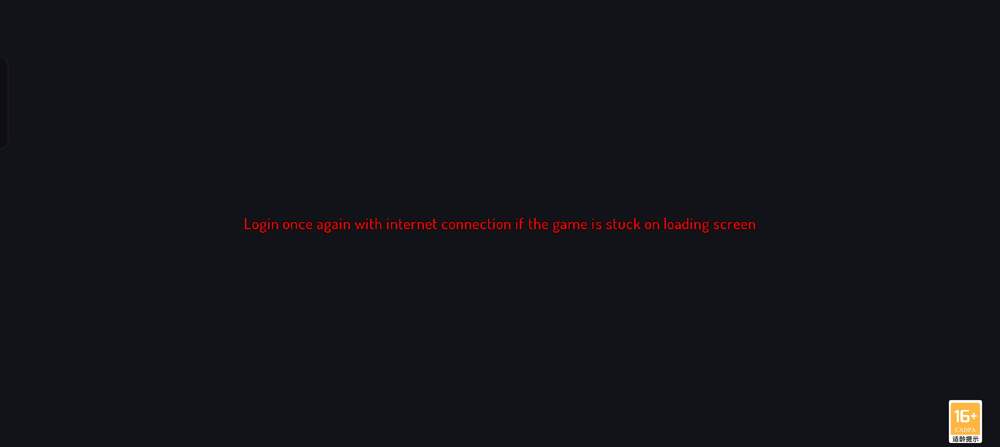
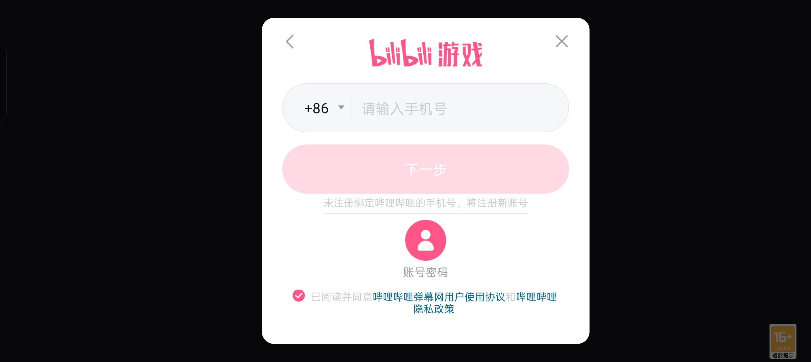

# Content Differences

## Homunculus Rune

In the Chinese mainland version, the detached head launched by the Homunculus Rune was initially **blue**, differing from the original green (algae-like) appearance in the Global version. Surprisingly, around late 2022 (roughly after the **Break the Bank** update), it was changed back to the original green.

It is speculated that the head was changed to blue in the Chinese mainland version to pass platform review requirements and comply with domestic game censorship standards, avoiding overly realistic gore and bloody imagery.

## Supported Languages

The Chinese mainland version supports **14 languages**, while the Global version notably lacks **Simplified Chinese** support.

In the Chinese mainland version, the in-game title is displayed as **"Rebirth Cells"** (重生细胞) only when set to Simplified Chinese. For all other languages, it is displayed as **"Dead Cells"** (Traditional Chinese: 死亡細胞).

| Chinese Mainland Version | Global Version |
|--------------------------|----------------|
|  |  |

## Account Login (Chinese Mainland Version Only)

The Chinese mainland version requires players to log in with a **Bilibili** platform account before entering the game. Additionally, the account must complete **real-name verification** (实名认证), as mandated by Chinese regulations. The Bilibili account manages the purchase status of the game and DLCs, and handles cloud saves for the Chinese mainland version.

Aside from the official Bilibili channel, Bilibili Game also distributes the game through other Chinese application distribution platforms, such as OEM app stores (e.g., Xiaomi, Huawei, OPPO) and third-party app stores. On these platforms, the login is typically handled through the respective OEM service account or the platform's own account system. One exception is **TapTap**, where the distributed version still uses a Bilibili account for login.

| Not logged in | Login prompt |
|---------------|--------------|
|  |  |

> [!WARNING]
> Because login is required to enter the game, the Chinese mainland version cannot be played while completely offline.

> [!IMPORTANT]
> If the real-name verified age is under 18, the game's **anti-addiction system** will be enforced: gameplay is limited to 1 hour per day, only on Fridays, Saturdays, Sundays, and statutory holidays from 20:00 to 21:00 (UTC+8). No game services are provided to minors at any other time. Players aged 18 and above are not restricted.

## Cloud Saves

In the Chinese mainland version, cloud saves are **manually uploaded** by the player. There are **two cloud save slots** available:

- **Upload**: Saves all local save files to the selected cloud slot.
- **Download**: Downloads all save files from the selected cloud slot to the local device.

In the Global version, cloud saves rely on the **Google Play Games** cloud save system (stored in Google Drive) and sync **automatically**.

> [!NOTE]
> For the Global version, a Google Play Games account login is required to use cloud saves.

Chinese Mainland Version:

Global Version:

